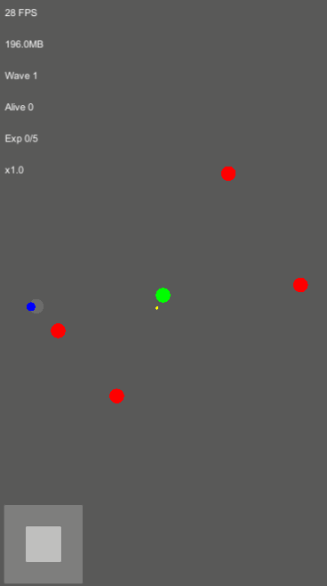
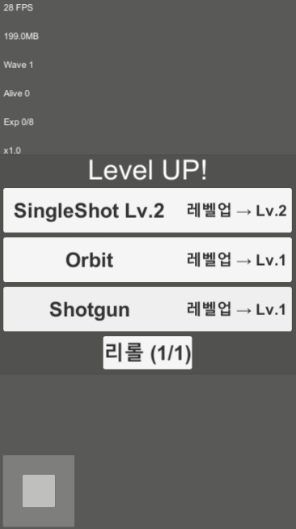
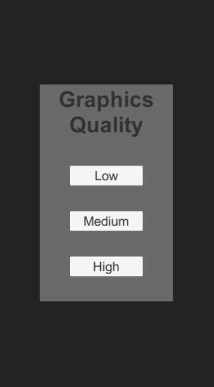

# 🧟‍♂️ Zombie Survivor 2D (Unity 2022.3.62f1, URP 2D)



> Unity 2022.3.62f1 · URP(2D Renderer) · Android / WebGL  
> **싱글플레이 2D 탑다운 좀비 서바이버 (웨이브 생존형)**

---

## 🎮 게임 개요

- 웨이브마다 적 수 증가, 러너/탱커 단계 등장
- 모바일 입력(조이스틱) + HUD
- 풀링 기반 최적화(ObjectPool)
- 자동 공격(버튼 없음)

---

## 🧩 핵심 시스템

| 시스템 | 설명 |
|--------|------|
| **ObjectPool / PooledObject** | Instantiate/Destroy 금지, 풀링 통합 |
| **BulletHitPierce** | Damage, Pierce, Splash 지원, 충돌 시 다음 프레임 반환 |
| **WeaponData / WeaponInstance / WeaponController** | 무기 데이터 + 인스턴스 레벨 관리 + 발사 로직(Single/Shotgun/Orbit) |
| **PassiveInventory** | MoveSpeed / Damage / ExpGain / Magnet 패시브 지원 |
| **LevelSystem** | 경험치/레벨업, 무기/패시브 선택 (리롤 1회) |
| **WaveManager** | 웨이브별 스폰 수 증가, 10웨이브마다 경험치 배수 ×1.5 |
| **PerfHUD** | FPS/메모리/웨이브/Alive/경험치 배수 HUD 표시 |

---

## 🖼️ 스크린샷

### 그래픽 설정


### 인게임 및 HUD


### 레벨업 UI


---

## 🛠️ 기술 스택

- **Unity 2022.3.62f1**
- **URP(2D Renderer)**
- **Incremental GC ON**
- **MSAA/HDR/PP 최소화**

---

## 📂 프로젝트 구조

```
Assets/
 ├─ Scripts/
 │   ├─ Combat/
 │   │   ├─ Bullet/
 │   │   └─ Weapons/
 │   ├─ Enemies/Runtime/
 │   ├─ Systems/
 │   │   ├─ Level/
 │   │   ├─ Settings/
 │   │   └─ Wave/
 │   └─ UI/
 ├─ Prefabs/
 ├─ Scenes/
 └─ ...
```

---

## 🚀 빌드 대상

- Android
- WebGL

---

## 📖 구현된 주요 기능

- **경험치 자석 효과**: 패시브 레벨업에 따라 경험치 흡수 범위가 확대
- **적/총알 풀링**: CPU/Garbage 최소화
- **URP 품질 프리셋**: 모바일 성능 최적화
- **Wave 시스템**: 10웨이브마다 경험치 배수 ×1.5

---

## 💡 코드 하이라이트

### WeaponController.cs (발사 로직)

```csharp
void SpawnBullet(Vector3 pos, Vector3 dir, WeaponInstance inst)
{
    BulletHitPierce go = bulletPool.Get();
    if (go == null) return;

    go.transform.position = pos;
    go.transform.rotation = Quaternion.identity;

    var rb = go.GetComponent<Rigidbody2D>();
    if (!rb) rb = go.gameObject.AddComponent<Rigidbody2D>();
    rb.gravityScale = 0f;
    rb.velocity = dir * inst.Speed();

    go.damage = Mathf.CeilToInt(inst.Damage(damageMul));
    go.pierce = inst.Pierce();
    go.splashRadius = inst.SplashRadius();
    go.splashRatio = inst.SplashRatio();

    go.gameObject.SetActive(true);
}
```

### WaveManager.cs (웨이브/경험치 배수)

```csharp
IEnumerator Run()
{
    while (true)
    {
        waveIndex++;
        CurrentWave = waveIndex;
        ExpMultiplier = Mathf.Pow(1.5f, waveIndex / 10);
        if (hud) hud.SetWave(waveIndex);
        if (hud) hud.SetExpMultiplier(ExpMultiplier);

        // ... 스폰 로직 ...
    }
}
```

---

## 📥 실행 방법

1. Unity 2022.3.62f1(LTS)에서 프로젝트 열기
2. `Scenes/Main.unity` 실행
3. Android 또는 WebGL로 빌드

---

## 📜 라이선스

이 프로젝트는 포트폴리오 목적으로 제작되었습니다.  
상업적 사용 시 별도 문의 바랍니다.
